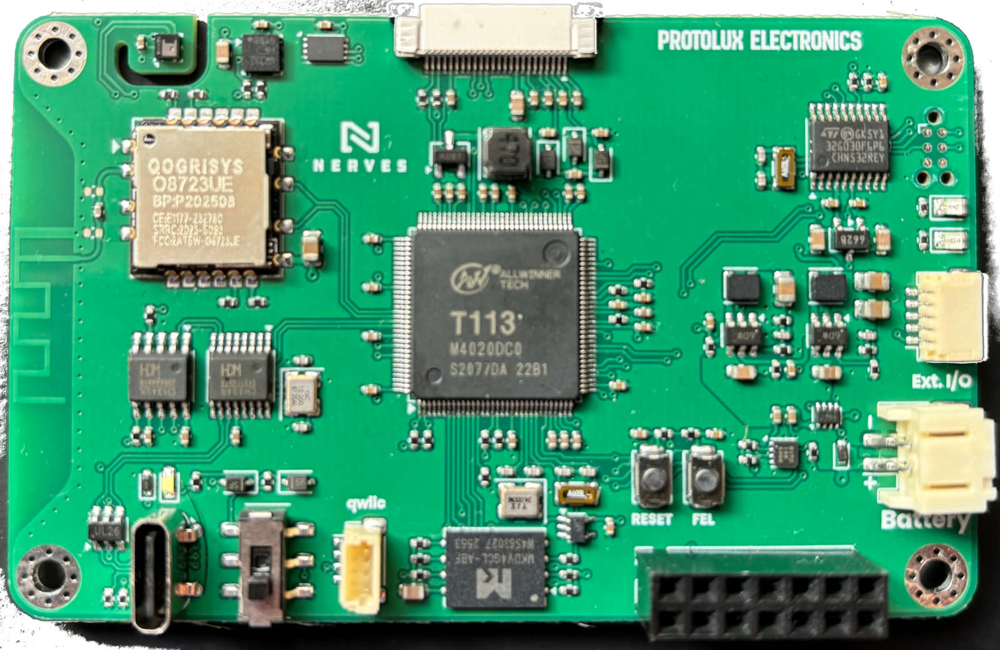
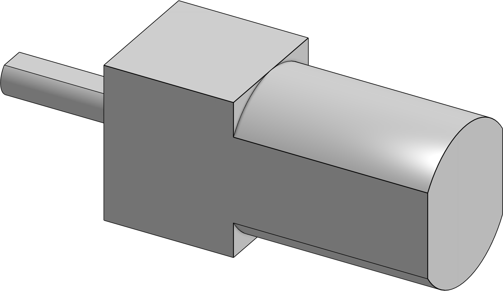
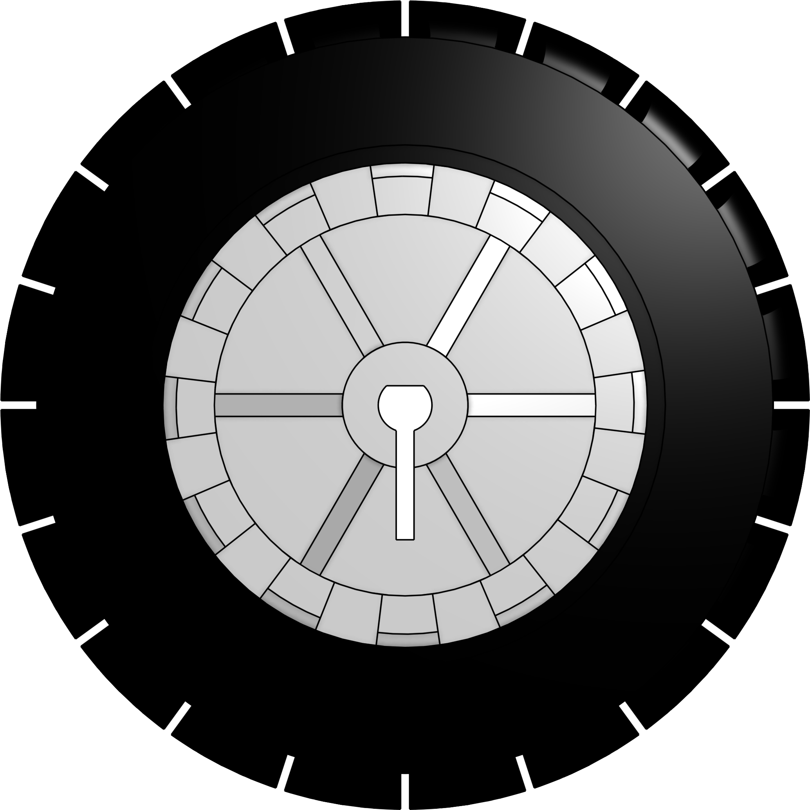
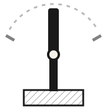
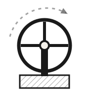
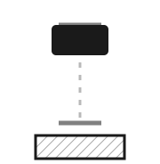
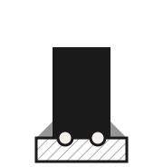
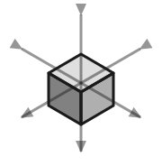

<!-- _class: fullbleed -->


<!--
Before anything else — a thank you to Campus Varberg and Tech Arena Varberg for
the room, the power, the wifi and the tables we're about to cover in cable tie
offcuts. None of this happens without somewhere to do it.

And yes, that's "varm" with an a. That's their joke, not mine, and I'm annoyed I
didn't get there first.
-->

---

<!-- _class: title norail -->

# Achieving Balance

## Bunch o' people. Bunch o' robots. One room.
## Goatmire 2026 · James Harton & Gus Workman

---

<!-- _class: concept s1 -->

<div class="chrome"><span>Today</span><span>4 hours</span></div>

# Agenda

| | |
|---|---|
| **Hour 1** | Intro, assembly & install |
| **Hour 2** | How to describe a robot |
| **Hour 3** | How to describe your robot |
| **Hour 4** | Putting it all together |

---

<!-- _class: two s1 -->

<div class="chrome"><span>Hour 1 · Intro</span><span>Who we are</span></div>

# Who we are

<div>

### James Harton

- Principal Engineer at Alembic
- Creator of Beam Bots
- Ash core-team member
- More than a decade of Elixir

</div>

<div>

### Gus Workman

- Protolux Electronics
- Nerves core-team member
- Designed and manufactured the Nerves Starter Kit
- ...and the balance bot add-on board

</div>

<!--
I'm James. I'm a Principal Engineer at Alembic, I created the Beam Bots robotics
framework, I'm on the Ash Framework core team, and I've been writing Elixir for
more than a decade. I live in a small town outside Wellington, New Zealand, with
not quite enough dogs.

And this is Gus. He's on the Nerves core team, and he runs Protolux Electronics.
Both of the boards in front of you are his — he designed and manufactured the Nerves
Starter Kit, and the balance bot add-on board we built for today.
-->

---

<!-- _class: concept s1 -->

<div class="chrome"><span>Hour 1 · Intro</span><span>What we're building</span></div>

# What we're building

- A two-wheeled robot that balances on its own
- A **Nerves Starter Kit** with a **Beam Bots add-on** carrying the motors and the motion sensor
- An e-paper display, four NeoPixels and three buttons
- Its own wifi, so your phone can drive it

<!--
What you're building today is a two-wheeled balance bot. There's no third wheel
and no kickstand — if it's upright, it's because the software is holding it
there, a couple of hundred times a second.

Underneath is Gus's Nerves Starter Kit, plus an add-on board we built for this
workshop that carries the motors and the motion sensor — the thing that tells it
which way is up.

By the end of the afternoon it'll stand up on its own, and you'll be driving it
around this room from your phone.
-->

---

<!-- _class: concept s1 -->

<div class="chrome"><span>Hour 1 · Intro</span><span>How it came about</span></div>

# How it came about

- **Goatmire 2025** — I met Gus, who built the conference badges
- Nerves-powered, and everyone went home with one
- Same 4" eInk display you've got in front of you
- Its board grew up into the **Nerves Starter Kit**
- Lars asked me for a robotics workshop, and I thought of the badge
- I pitched it to Gus, who was on board before I'd finished asking

<!--
This all started here, at last year's Goatmire.

Gus had built the conference name badges — the ones we all went home with.
Nerves-powered, with a four inch eInk display. The same display that's sitting
on the table in front of you right now. And the board behind it went on to become the Nerves
Starter Kit.

So if you were here last year, you've already got one of these panels at home.

So when Lars asked me whether I could put together a robotics workshop, that
name badge came straight to mind. I wanted to turn it into a balance bot.

I pitched the idea to Gus expecting to have to talk him into it, and he was
enthusiastically on board straight away — which honestly took me by surprise.

That's what you're all about to build.
-->

---

<!-- _class: parts norail -->

<div class="chrome"><span>Hour 1 · Assembly</span><span>Your parts</span></div>

# Make sure you have these parts

<div class="grid">
<figure><figcaption><strong>1 ×</strong> Nerves Starter Kit</figcaption></figure>
<figure><figcaption><strong>1 ×</strong> Balance bot add-on board</figcaption></figure>
<figure><figcaption><strong>1 ×</strong> 4" eInk display</figcaption></figure>
<figure><figcaption><strong>1 ×</strong> Button board + wire</figcaption></figure>
<figure><figcaption><strong>1 ×</strong> Chassis half A</figcaption></figure>
<figure><figcaption><strong>1 ×</strong> Chassis half B</figcaption></figure>
<figure><figcaption><strong>2 ×</strong> Gearmotors</figcaption></figure>
<figure><figcaption><strong>1 ×</strong> Battery, tape already on</figcaption></figure>
<figure><figcaption><strong>2 ×</strong> Wheels</figcaption></figure>
<figure><figcaption><strong>6 ×</strong> Cable ties</figcaption></figure>
</div>

<!--
Have a look at what's in front of you. Everything shown here should be on the
table, and it should all be present before anybody starts building.

The eInk display and its ribbon cable are the most fragile parts in the kit, so
be gentle with them.

If you're missing some parts, please raise your hand and we'll come and sort you
out.

Once everyone is sure that they have all the correct parts, we'll move on to the
assembly.
-->

---

<!-- _class: assembly norail -->

<div class="num">1</div>

# Connect the display

1. Double-check the **Nerves Starter Kit** is switched off — switch position **up**
2. **NSK board face up**, USB connector and pin headers pointing towards you
3. **The 4" eInk display above it**, display side up
4. Carefully open the connector latch, slide the ribbon cable in, close the latch


<!--
Let's start by getting the most nerve-wracking part out of the way first.

That connector is very fiddly. Feel free to borrow some tweezers if, like me,
you're afflicted with frankfurter fingers.
-->

---

<!-- _class: assembly norail -->

<div class="num">2</div>

# Stack the add-on board

1. Carefully align the **NSK's pin headers** with the socket headers on the balance bot add-on board
2. Gently press the boards together — every pin into its own socket, none bent
3. The **USB-C connector and power switch** stay reachable through the cut-out


<!--
Flip the add-on board over so that the pins face down and the Nerves and Beam
Bots logos are facing you.

Be careful of the pin alignment between the two boards.
-->

---

<!-- _class: assembly norail -->

<div class="num">3</div>

# Fold the display forward

1. Fold the display over the top edge so it faces **forward**
2. One soft bend over the edge — don't crease it

<p class="note">Yes, the display ends up upside-down. It's meant to be, and the firmware turns the picture the right way up.</p>


<!--
This one's straightforward. It gets a slide of its own purely because of how
fragile that ribbon cable is.

One soft fold over the top edge. Don't crease it and don't tug on it.

And yes, the display ends up upside-down. That's deliberate — the firmware turns
the picture the right way up.
-->

---

<!-- _class: assembly norail -->

<div class="num">4</div>

# Thread the cable ties

1. Find the chassis half marked **A**
2. Feed a cable tie in through the marked hole, bend it around, and poke it back out the top hole
3. **Do not close it**
4. Repeat on the half marked **B**

<p class="note">You'll pull these tight much later. Close one now and you'll have to cut it off and start again.</p>


---

<!-- _class: assembly norail -->

<div class="num">5</div>

# Slide the stack into A

1. Slide the display and boards into their slots on part **A**
2. It's fiddly, so take your time. It'll go together — don't force it

<p class="caution">Don't put any stress on the display's ribbon cable.</p>


<!--
If you look carefully into part A you should be able to see the three slots that
the two boards and the display will slip into.

You may need to wiggle things a little to get them in.

And again — be careful of the display's ribbon cable.
-->

---

<!-- _class: assembly norail -->

<div class="num">6</div>

# Close it up with B

1. Repeat step 5 for side **B**, bringing it onto the other side of the stack
2. Same again — watch the alignment and take your time

<p class="caution">Don't pinch the display's ribbon cable between the two halves as they come together.</p>


---

<!-- _class: assembly norail -->

<div class="num">7</div>

# Fit the first motor

1. Feed the **motor wires** through the mounting holes first
2. Feed the motor through until it sits **flush with the edge of the chassis**
3. Plug it into the add-on board, using the connector that **faces towards that motor**

<p class="note">Each motor goes to the connector on its own side. Cross them over and you'll swap the robot's left and right.</p>


---

<!-- _class: assembly norail -->

<div class="num">8</div>

# Fit the second motor

1. Repeat step 7 for side **B**
2. Both motors flush with the chassis, and each plugged into the connector on its own side


---

<!-- _class: assembly norail wide -->

<div class="num">9</div>

# Zip-tie the motors

1. **Two cable ties on each side**, four in total
2. In from the **front** through the lower hole, then back out through the **upper hole**
3. Repeat four times
4. The motors are a snug fit already, but pull each tie quite tight — you want **no wobble or play** at all
5. Trim the ends off the ties

<p class="note">Not the ties from step 4 — those stay threaded and open.</p>


<!--
Pull these cable ties as tight as you can with just your fingers. We want the
motors really locked in.
-->

---

<!-- _class: assembly norail -->

<div class="num">10</div>

# Fit the button board

1. Take the **button board** and thread its cable down through the slot in side **B**
2. Plug the cable into the connector on the **edge of the NSK board**

<p class="note">Tweezers or pliers help here — you reach the connector through the cut-outs in the side of the chassis.</p>


---

<!-- _class: assembly norail -->

<div class="num">11</div>

# Secure the button board

1. Thread the cable ties from **step 4** through the holes on the button board
2. Seat the board on the chassis **shelf**, buttons sitting in the recesses
3. Close and tighten the ties — just enough to hold it without wobble or vibration
4. Trim the ends off the ties

<p class="note">You should be able to reach and press the buttons from the top edge of the board.</p>


---

<!-- _class: assembly norail -->

<div class="num">12</div>

# Wheels on

1. Press the wheel all the way onto the motor shaft — a flat on the shaft lines up with a flat in the wheel's axle hole
2. Carefully pull it back off a fraction, just until the wheel **spins free** without rubbing on the chassis
3. Repeat on the other side

<p class="danger"><strong>The wheels go on "backwards"</strong> — dished side facing out, because the motor shafts are short. It looks wrong. It is right. Leave it that way.</p>


---

<!-- _class: assembly norail -->

<div class="num">13</div>

# Fit the battery

1. Thread the battery cable down the thin gap in the chassis behind the screen. The connector is chunky, but there is a gap at the centre to thread it through
2. Slide the battery into the same slot, **tape facing towards the back**, and feel how it sits with about **10 mm** protruding

<p class="caution">Be very careful not to crush or crease the display's ribbon cable as the battery slides in. That's why the tape is on the back, not the front.</p>


---

<!-- _class: assembly norail -->

<div class="num">13 <span class="cont">cont.</span></div>

# Stick it down and connect it

1. Happy with the position? Slide it back out far enough to peel the covering off the tape
2. Slide it back in and press gently towards the rear of the bot
3. Connect it to the connector on the side of the NSK board, **next to the button board's** — tweezers through the side cut-out again if you need them

<p class="danger"><strong>That's a lithium polymer cell</strong> — dangerous if you crush or puncture it. Tweezers on the connector, fingers on the battery.</p>


---

<!-- _class: assembly norail -->

<div class="num">14</div>

# That's a robot

Before you put it down:

- Is the battery seated, and its cable connected?
- Is the button board firm, with the tie ends trimmed?
- Do both wheels spin free without rubbing?
- Can you press the buttons from the top edge?

<p class="note">Give it a gentle shake. Nothing should rattle or shift.</p>


---

<!-- _class: wall -->

### Hour 1 · Before the project

# You'll need an SSH key

```
$ ls ~/.ssh/id_*.pub || ssh-keygen -t ed25519
```

Nerves bakes your public key into the firmware so you can log into the robot. No key, no build.

<!--
Start here, because this one stops the build before it starts and the error
doesn't look like it has anything to do with what you were doing.

A Nerves project puts your public key into the firmware, so that later you can
ssh into the robot. And the generated config refuses to load at all if it can't
find one in ~/.ssh — so you don't get a warning at the end, you get a wall about
SSH keys the first time you touch the target.

If you've never made one on this laptop, that command makes one. Press return
three times and take the defaults.
-->

---

<!-- _class: wall -->

### Hour 1 · Before the project

# Host tools

```
# macOS
$ brew install fwup libusb dtc zlib pkg-config
# ...and on Apple Silicon, if a build says libfdt.h is missing
$ export DTC_PREFIX=$(brew --prefix dtc)
```

```
# Debian / Ubuntu
$ sudo apt install fwup libusb-1.0-0-dev libfdt-dev zlib1g-dev pkg-config
```

`fwup` writes firmware. The rest build the USB tools.

<!--
These too, before anything else — they're the ones that bite, and they bite an
hour later when you've forgotten you skipped them.

fwup is how Nerves writes a firmware image. Nothing flashes without it.

The other four are build dependencies for talking to the board over USB. The
tooling that puts an Allwinner chip into recovery mode is a C library we compile
on your machine, and it wants libusb to reach the USB device and libfdt — which
comes in the dtc package — to read the device tree out of the image it sends.

No serial driver on this list, and that's deliberate. There's a convenience
command later that resets the board for you over its serial port, and on a Mac
it wants a driver from the chip vendor that is a kernel extension — security
prompts, a trip through System Settings, a reboot, and on Apple Silicon it
still can't toggle the lines we need. We're not doing that to you. Mac people
press a button on the board instead, and it takes a second.

Linux people get the convenience command for free — ch341 has been in the
kernel for years.

If you're on an Apple Silicon Mac and the build later complains that libfdt.h is
missing even though you installed dtc, that's a Homebrew path problem, not you.
Put DTC_PREFIX=$(brew --prefix dtc) in front of the command and it'll find it.
-->

---

<!-- _class: wall -->

### Hour 1 · Install

# Set up your project

```
$ mix archive.install hex nerves_bootstrap
$ mix archive.install hex igniter_new
$ mix igniter.new eunice --with nerves.new \
    --with-args="--target trellis" --install bb_nsk
$ cd eunice
```

Every robot needs a great name. Swap `eunice` for yours.

<!--
Open your favourite terminal.

Two archives first: nerves_bootstrap, which knows how to make a Nerves project,
and igniter_new, which knows how to make one with things already installed in
it.

Then one command builds the project, targets it at this board, and pulls in
bb_nsk — the board support for the Nerves Starter Kit and the balance bot
add-on. That's the Nerves system, the device tree your add-on hardware needs,
and a robot module with the balance bot's measured geometry already in it.

It adds no hardware. No wheels, no motion sensor, no balance loop. Those are
separate commands, and we'll run them one at a time as the afternoon goes on.

Mine's called Eunice. Every robot needs a great name, so take a moment and pick
a lovely one — you'll be living with it all afternoon, and it'll be on the side
of the box in your repo.
-->

---

<!-- _class: step armed -->

### Hour 2

# How to describe a robot

Before we describe *yours*, let's look at what Beam Bots gives you to describe a robot with.

---

<!-- _class: concept s2 -->

<div class="chrome"><span>Hour 2 · Describing a robot</span><span>Meet your robot</span></div>

# Open `lib/eunice/robot.ex`

- Around a hundred lines, and the comments say where the numbers came from
- Three commands, and a body with real dimensions and a real mass
- Nothing that senses. Nothing that moves. Not yet

There's a lot in there. Don't worry — we're about to go through all of it.

<!--
Open it up. It's in lib, named after whatever you called your robot.

It's a lot, and that's fine — you're not meant to understand it yet.

Do read the comments, though. They're there to tell you where each measurement
came from, and in particular which of them were measured and which were found by
trying values until the robot stopped falling over. The centre of mass has one
of each.

Three commands rather than two. The extra one is poweroff, and please use it.

There's a power switch on the side, and that's exactly the problem — a switch
cuts power the moment you flick it, including halfway through a write to the
robot's own storage. That's how an afternoon of tuning goes missing. Run
poweroff, let it settle, then flick the switch.

It's disarmed-only as well, because taking the operating system out from under a
balancing robot drops it on the floor.

And a body. Real dimensions, real mass, real inertia, from the CAD model and a
set of scales.

What it hasn't got is anything that senses, or anything that moves. No motion
sensor, no wheels, no balance loop. Those are separate commands you'll run later
this afternoon.

So: a robot with a shape and no senses. Which, as it turns out, is enough to
start it up.

Right — let's go through what's actually in there.
-->

---

<!-- _class: two s2 -->

<div class="chrome"><span>Hour 2 · Describing a robot</span><span>The vocabulary</span></div>

# What a robot is made of

<div>

### The shape

- **links** — the rigid bits
- **joints** — how they move

### The senses

- **sensors** — what they measure
- **estimators** — working it out

</div>

<div>

### The doing

- **actuators** — move a joint
- **controllers** — decide what to do

### The rules

- **commands** — what you can ask
- **states** — when you can ask

</div>

**parameters** — configuration values that you can change at runtime

<!--
Every one of those is a block in the DSL, and every one of them is a process at
runtime. Your robot module isn't configuration that something else reads — it
compiles into a supervision tree shaped like the machine.

You've got three of these already. Links and joints, because the installer gave
you a body. Commands, because it gave you three. And parameters, quietly, from
the store it set up.

What you haven't got is anything under the senses or the doing — no sensors, no
estimators, no actuators, no controllers. That's what the next two hours are
for.

Let's take them one at a time.
-->

---

<!-- _class: concept s2 -->

<div class="chrome"><span>Hour 2 · The vocabulary</span><span>First, some kinematics</span></div>

# Kinematics

- Where every part of the robot is, relative to every other part
- A chain of **links**, connected by **joints**
- Every link carries a frame; every joint says how two frames may move
- Tell it where the joints are, and it can tell you where anything is

<!--
Before we get into links and joints, a word about what they're for.

Kinematics is the business of knowing where things are. Your robot is a chain of
rigid pieces, connected by things that move, and if you know how far each joint
has moved then you can work out where every part of the machine is in space.

That matters more than it sounds. When your motion sensor says "I'm tilted twelve
degrees", that's twelve degrees in the sensor's own frame — and the sensor is
mounted sideways, halfway up the body. Kinematics is what turns that into "the
robot is leaning twelve degrees", without you doing trigonometry by hand.
-->

---

<!-- _class: code s2 -->

<div class="chrome"><span>Hour 2 · The vocabulary</span><span>Where the chain starts</span></div>

# It starts at the world

```elixir
link :world do
  joint :ground do
    type :planar        # where it is on the floor

    link :ground_contact do
      joint :lean do
        type :revolute  # how far it's tipped over
```

The topology describes a whole kinematic system, not just the robot.

<!--
Here's the bit that catches people out.

Look at your own topology and the first thing in it isn't your robot at all —
it's a link called :world. Which seems odd, until you ask what the robot is
attached to.

Nothing. It isn't bolted to a bench. It's free to move about the floor and free
to tip over, and those are real degrees of freedom. The honest way to describe
them is as joints between the world and the robot — so :ground carries where it
is on the floor, and :lean carries how far it's tipped over.

And here's the lovely part: nothing drives those joints. There's no actuator on
:ground or :lean. They aren't things you command — they're things that happen to
you, and the sensors tell you how much. A balance bot is a robot whose most
important joint is one it can't control.
-->

---

<!-- _class: code compact s2 -->

<div class="chrome"><span>Hour 2 · The vocabulary</span><span>1 of 9</span></div>

# Links

```elixir
link :base_link do
  visual do
    box x: ~u(20.7 millimeter), y: ~u(99 millimeter), z: ~u(124 millimeter)
  end

  inertial do
    mass ~u(138 gram)
    origin x: ~u(2.4 millimeter), z: ~u(45.5 millimeter)
  end
end
```

A rigid chunk of robot. It doesn't bend, and everything else hangs off one.

<!--
A link is a solid piece. The body, a wheel, the board — anything you'd treat as
one lump that doesn't flex.

This is straight out of your file, trimmed a bit. Yours has three links —
world, ground_contact and base_link — and base_link is the robot's body. It's
the only one with anything in it: a shape and a mass.

Those are real numbers, off the CAD model and a set of scales. A hundred and
thirty-eight grams, and a body 124mm tall.

And notice every one of them carries its unit. That's the ~u sigil, and it's not
decoration — physical quantities always take one, never a bare number. It's how
the framework knows that 20.7 millimetres isn't 20.7 metres.

Here's what else can go in a link.
-->

---

<!-- _class: concept s2 -->

<div class="chrome"><span>Hour 2 · The vocabulary</span><span>What goes in a link</span></div>

# What goes in a link

- **inertial** — its mass, and how that mass is spread about
- **visual** — what it looks like
- **collision** — the shape used for working out what it bumps into
- **sensor** — anything measuring from this spot
- **estimator** — anything working things out from what's measured
- **joint** — and how the next link hangs off this one

<!--
Six things, and you'll meet all of them today.

Inertial is mass and how it's distributed. That's what makes the difference
between a model you can draw and a model you can do physics with — and a balance
bot very much needs the physics.

Visual is what it looks like. Collision is the shape used for bumping into
things, and it's separate because the pretty shape and the cheap-to-compute shape
are usually not the same. A visual might be a detailed mesh; its collision is
often just a box.

Sensors and estimators hang off a link because where they are matters. A sensor
on the wheel sees something different from one on the body.

And joints, which are how you get from this link to the next one — which is where
we're going.

Two of these are one-per-link: inertial and visual. A link has one mass and one
appearance. The rest you can have as many of as you like.
-->

---

<!-- _class: code s2 -->

<div class="chrome"><span>Hour 2 · The vocabulary</span><span>2 of 9</span></div>

# Joints

```elixir
joint :left_wheel_joint do
  type :continuous
  origin y: ~u(55 millimeter)
end
```

How one link moves relative to another. Six types to choose from.

<!--
If links are the bones, joints are the way they're allowed to move.

Units again, same as the last slide — an origin is a physical quantity, so it
takes one.

There are six types, and they're worth a look one at a time.
-->

---

<!-- _class: anim s2 -->

<div class="chrome"><span>Hour 2 · The vocabulary</span><span>Joint types</span></div>

# Rotation, with and without stops

<div class="pair">
<figure><figcaption>:revolute<span>stops at its limits</span></figcaption></figure>
<figure><figcaption>:continuous<span>keeps going round</span></figcaption></figure>
</div>

<!--
Both of these are rotation about a single axis. The only difference is whether
you declare limits.

Revolute stops. An elbow, a servo horn, a lid — and a wheel too, if you only ever
want it to turn so far. It declares how far it may go, and the framework holds
you to it.

Continuous doesn't stop, which is what you want for a wheel.

BB won't insist you sense where a continuous joint is, because there are no
limits for it to violate. That's not the same as saying you can't — a magnetic
encoder like an AS5600 will happily tell you where a wheel is pointing, and
that's how you'd get odometry.

Yours hasn't got one. Hold that thought, because it's the reason for the most
interesting problem we'll hit this afternoon.

Your bot ends up with both types: the lean is revolute, and the two wheels are
continuous.
-->

---

<!-- _class: anim s2 -->

<div class="chrome"><span>Hour 2 · The vocabulary</span><span>Joint types</span></div>

# Sliding, and not moving at all

<div class="pair">
<figure><figcaption>:prismatic<span>slides along an axis</span></figcaption></figure>
<figure><figcaption>:fixed<span>doesn't move, on purpose</span></figcaption></figure>
</div>

<!--
Prismatic is the straight-line version of revolute. It slides along one axis
between two stops — a drawer, a linear actuator, a print head.

And then there's fixed, which is my favourite, because it doesn't move at all.
That's the animation. You're welcome.

Which raises the obvious question: why would you want a joint that can't move?

Because a joint is how you say where something is. Your motion sensor is soldered
to the front of the add-on board, standing upright, halfway up the body.

Soldered. With an L. Gus says "soddered", but he's American, so on this slide
we'll let it slide.

That position and orientation, relative to the rest of the robot, is exactly what
a fixed joint is for. You write it down once and the framework does the
trigonometry for you forever.

Ours uses two of them just to mount that one sensor.
-->

---

<!-- _class: anim s2 -->

<div class="chrome"><span>Hour 2 · The vocabulary</span><span>Joint types</span></div>

# More than one freedom at a time

<div class="pair">
<figure><figcaption>:planar<span>slide, slide and turn</span></figcaption></figure>
<figure><figcaption>:floating<span>nothing held at all</span></figcaption></figure>
</div>

<!--
The last two are the ones that do more than one thing.

Planar is three freedoms at once: slide one way, slide the other, and turn.
That's this diagram seen from above, which is why it looks different from the
rest — you can't show two directions of travel from the side.

And this is the one your robot needs. A bot on a floor can go forwards, go
sideways and spin. That's a planar joint, and it's how yours will reach the
world.

Floating is all six: three ways to move, three ways to turn, nothing held. Notice
there's no ground and no mounting in that picture — that's the whole idea. You'd
use it for a drone, or anything that isn't touching the floor.

And remember what I said earlier: neither of these has an actuator on your robot.
Nothing drives them. They're how the world moves you about, and the sensors are
how you find out.
-->

---

<!-- _class: code s2 -->

<div class="chrome"><span>Hour 2 · The vocabulary</span><span>3 of 9</span></div>

# Sensors

```elixir
sensor :imu, {BB.Sensor.BMI323,
  bus: "i2c-0", address: 0x68}
```

A process that reads some hardware and publishes what it measured.

<!--
Sensors hang off a link, because where a sensor is matters. They run as their own
process, talk to the hardware, and publish measurements for anyone who's
subscribed.

Nobody asks a sensor for a reading. It just tells everyone, continuously.
-->

---

<!-- _class: code s2 -->

<div class="chrome"><span>Hour 2 · The vocabulary</span><span>4 of 9</span></div>

# Estimators

```elixir
estimator :orientation,
  {BB.Estimator.Ahrs.Mahony, kp: 0.4}
```

Turns measurements into the thing you actually wanted.

<!--
Here's the one people don't expect.

Your motion sensor gives you acceleration and rotation rate. Neither of those is
"which way is up" — that takes filtering the two together over time, and that's
an estimator's job.

This one sits inside the sensor block, because it's part of that sensor's answer.
They can also hang off a link, when what they're working out belongs to the robot
rather than to any one sensor.
-->

---

<!-- _class: code s2 -->

<div class="chrome"><span>Hour 2 · The vocabulary</span><span>5 of 9</span></div>

# Actuators

```elixir
actuator :left_wheel, {Eunice.Wheel,
  forward_pwm: 3, enable_pin: "PE6"}
```

Hangs off a joint, takes a command, and makes the hardware move.

<!--
An actuator is the other half of a joint. The joint says this wheel can spin; the
actuator is the thing that actually spins it.

Which means a joint with no actuator is a perfectly good joint — it just moves
because the world moved it, not because you asked.
-->

---

<!-- _class: code s2 -->

<div class="chrome"><span>Hour 2 · The vocabulary</span><span>6 of 9</span></div>

# Controllers

```elixir
controller :balancer,
  {Eunice.Balance.Controller, gain: 180.0}
```

Listens, decides, commands. This is where your loop lives.

<!--
A controller subscribes to whatever it needs, does its sums, and tells actuators
what to do.

The balance loop you'll write in hour four is a controller. It wakes up every
time the motion sensor publishes, works out how far over the robot is leaning,
and commands the wheels.
-->

---

<!-- _class: code s2 -->

<div class="chrome"><span>Hour 2 · The vocabulary</span><span>7 of 9</span></div>

# Commands

```elixir
command :stand do
  handler Eunice.Command.Stand
  allowed_states [:idle, :fallen]
end
```

The things you're allowed to ask the robot to do.

<!--
You've already got two of these: arm and disarm.

A command is a process with a goal and a result — it runs, it finishes, it tells
you how it went. That's different from a controller, which just runs forever.

And note allowed_states. A command declares when it's legal.
-->

---

<!-- _class: code s2 -->

<div class="chrome"><span>Hour 2 · The vocabulary</span><span>8 of 9</span></div>

# States

```elixir
state :balancing,
  doc: "Actively holding itself upright"
```

Where the robot is in its own life, and which commands are legal there.

<!--
Every robot starts with disarmed and idle. You add whatever else your machine
needs — ours will get balancing and fallen.

This is the safety system. A robot that has fallen over shouldn't accept a
"drive forwards" command, and states are how you say so once instead of checking
everywhere.
-->

---

<!-- _class: code s2 -->

<div class="chrome"><span>Hour 2 · The vocabulary</span><span>9 of 9</span></div>

# Parameters

```elixir
parameters do
  group :balance do
    param :proportional_gain,
      type: :float, default: 180.0,
      min: 0.0, max: 250.0
  end
end
```

Numbers with a type, a default and bounds. Groups give them a path.

<!--
And the last one, which is where you'll spend most of hour four.

A parameter is a configuration value with a type, a default, and optionally
bounds. Every write is checked against them, so you can't set a gain to "banana"
or to minus four hundred.

Groups nest them, and the nesting gives you a path — this one is
[:balance, :proportional_gain].

Declaring it is half the story. The other half is what happens when you change
it.
-->

---

<!-- _class: code s2 -->

<div class="chrome"><span>Hour 2 · The vocabulary</span><span>Tuning them</span></div>

# Change them while it's running

```elixir
iex> BB.Parameter.get!(Eunice.Robot, [:balance, :proportional_gain])
180.0

iex> BB.Parameter.set(Eunice.Robot, [:balance, :proportional_gain], 200.0)
:ok
```

No rebuild. No reboot. Not even a pause.

<!--
This is the bit that makes the afternoon bearable.

A parameter isn't read once at boot. Any component that referenced it with
param([...]) in its declaration gets re-resolved when the value changes, and BB
calls that component's handle_options callback with the new numbers. The
controller just picks it up.

There's a dashboard later this afternoon that does this from your phone, but
underneath it's this call.

So you can have the robot balancing on the table, change a gain from IEx, and
watch the behaviour change under your hand. No firmware build, no reboot, no
putting it down.

Every change is also published on [:param | path], so anything else that cares
can subscribe. That's how the dashboard's parameter panel stays live.

Tuning a balance controller means trying a lot of numbers. If each one cost you a
firmware build, you'd try about four. This way you'll try forty.
-->

---

<!-- _class: concept s2 -->

<div class="chrome"><span>Hour 2 · Describing a robot</span><span>The idea</span></div>

# A robot is a supervision tree

- Each **sensor**, **actuator**, **estimator** and **controller** is a process
- The DSL describes the machine; BB starts and supervises it
- A sensor that falls over gets restarted, and the rest keeps running
- Which means you can run a robot with **no robot attached**

<!--
This is the bit worth holding on to.

The topology isn't a config file that something parses at runtime. It compiles.
The links and joints become a struct you can do kinematics against, and the
sensors, actuators and controllers become processes under a supervisor.

That's why the next thing we're going to do works at all — you can boot the whole
thing on your laptop, with no hardware anywhere near it, and it's a real robot.
It just has nothing to sense and nothing to move.
-->

---

<!-- _class: wall -->

### Hour 2 · Have a play

# Start your robot

```
$ iex -S mix
iex> Eunice.Robot.robot()
iex> Eunice.Robot.arm()
iex> Eunice.Robot.disarm()
```

No hardware. No firmware. It's still a robot.

**Stretch goal** — Mauricio's dashboard, for a robot that can't do anything yet:

```
$ mix igniter.install bb_tui --nerves
$ mix bb.tui --robot Eunice.Robot
```

<!--
Right — have a play.

Start an IEx session. Your robot boots with the application, so it's already
running.

`robot()` gives you the compiled struct — the links and joints, such as they
are.

`arm()` and `disarm()` drive the safety state machine. Watch what it returns.
Then try arming it twice, and see what happens — the states in the DSL decide
which commands are legal when.

Nothing moves, because there's nothing to move. That's the point. Next hour we
tell it about the board in front of you.

If you get through that quickly, there's a stretch goal. Mauricio Cassola — who
is in this room — has built a terminal dashboard for BB robots: safety controls,
a joint table, an event stream, the command list. Install it and point it at
Eunice.

It'll be a fairly empty dashboard. One link, no joints, two commands. But it's a
much nicer way to watch the state machine than typing arm and disarm at it, and
it'll fill up as the afternoon goes on.

The --nerves flag is worth passing now even though we're nowhere near the
hardware yet. It hangs the dashboard off the SSH daemon your robot already runs,
so later today you'll be able to SSH into the bot and get the same dashboard,
live, while it's balancing.
-->

---

<!-- _class: checkpoint s2 -->

<div class="chrome"><span>Hour 2 · Describing a robot</span><span>Checkpoint</span></div>

# Where you should be

- Does `iex -S mix` start without complaining?
- Does `Eunice.Robot.robot()` hand you back a struct?
- Does `arm()` hand you back `{:ok, pid}`, and `disarm()` after it?
- What happens if you `arm()` twice? Why?

---

<!-- _class: step tuning -->

### Hour 3

# How to describe your robot

Two commands, and it gains wheels and a sense of which way is up.

<!--
Hour two was the vocabulary. This hour we use it.

Two tasks. One gives the robot wheels it can actually drive, the other gives it
a sense of which way up it is. Both of them write into the robot module you've
been reading, so you'll be able to see exactly what changed.

And somewhere in the middle we put firmware on the board for the first time.
-->

---

<!-- _class: wall -->

### Hour 3 · Run this

# Give it wheels

```
$ mix bb_nsk.add_wheels
```

Two joints, two actuators, and a parameter for the motor deadband.

<!--
First one. This hangs a joint off base_link for each wheel, puts a DRV8837
actuator on each joint, and adds a parameter group for the motor deadband.

Run it, then open robot.ex and look at what changed — that's the next slide.
-->

---

<!-- _class: code compact s3 -->

<div class="chrome"><span>Hour 3 · Describing your robot</span><span>What add_wheels wrote</span></div>

# A joint that can be driven

```elixir
joint :left_wheel_joint do
  type :continuous
  axis roll: ~u(-90 degree)
  origin y: ~u(55 millimeter)

  actuator :left_wheel,
    {BB.NSK.Wheel,
     forward_pwm: 3, reverse_pwm: 2, enable_pin: "PE6",
     deadband: param([:motor, :deadband])}
end
```

Everything from hour two, in one block.

<!--
Look at what's in there. A continuous joint, because a wheel goes round forever.
An axis and an origin, in real units — 55mm out from the centre line. And an
actuator, which is the thing that makes it turn.

Then look at the last line. deadband isn't a number, it's a reference to a
parameter. Change that parameter at runtime and this actuator gets handed the
new value, without a rebuild. That's the thing we talked about in hour two, and
this is the first place you'll see it earn its keep.

The other joint is the same with the numbers mirrored.

And that word deadband deserves a slide of its own.
-->

---

<!-- _class: code compact s3 -->

<div class="chrome"><span>Hour 3 · Describing your robot</span><span>The one motor thing</span></div>

# The motor ignores small commands

```elixir
# on the actuator, from the last slide
deadband: param([:motor, :deadband])

# and the parameter it points at
group :motor do
  param :deadband, type: :float, default: 0.01, min: 0.0, max: 0.9
end
```

Below about 1% duty the motor won't turn at all — and a balance loop lives right there, near zero.

<!--
This is the one thing about the motors worth knowing, and it will bite you in
hour four if you don't.

Motors have a duty cycle below which they simply don't turn. Friction in the
gearbox, stiction in the brushes — you ask for one percent and nothing happens.
Measured on the bench, unloaded: the 500 rpm motors we started with needed forty
percent duty just to keep turning, and sixty to start from rest. The 300 rpm
ones in your robot are far better, around one percent.

Now think about where a balance controller spends its life. Hovering around
zero, making tiny corrections. Which is precisely where the dead zone is. So
without compensation, the loop does absolutely nothing until the error is big
enough to escape it — and by then the robot is already on its way to the floor.

The fix is that deadband parameter. Every command gets lifted so the smallest
non-zero one lands just above the point the motor starts moving, and the range
is squashed rather than shifted, so full duty still means full duty.

It does make the response jump at zero: the tiniest command becomes a small but
visible step. That's the honest trade — a step you can see beats a dead zone you
can't.

And it's a parameter because the bench figure was measured with nothing attached.
Under the robot's own weight it'll be higher, so this is one of the numbers you
may find yourself tuning later.
-->

---

<!-- _class: concept s3 -->

<div class="chrome"><span>Hour 3 · Describing your robot</span><span>A warning</span></div>

# Left and right belong to the robot

- Stand in front of it and its left is on **your right**
- The PWM channels were confirmed by driving each wheel and watching
- We have got this wrong **three times**

If a wheel turns the wrong way, drive it and watch. Don't reason it out from the schematic.

<!--
Quick warning before we go further, because this one has bitten us repeatedly.

Left and right are the robot's, not yours. Standing in front of it looking at
it, its left is on your right.

Those PWM channel numbers on the last slide aren't from the schematic. They were
worked out by driving each wheel and seeing which way the robot went, because
we'd got it wrong from the schematic three separate times — the sensor axes, the
wheel sides, and which way the motors turned.

So if a wheel goes the wrong way this afternoon, don't sit and think about it.
Drive it and watch it.
-->

---

<!-- _class: wall -->

### Hour 3 · Run this

# Give it a sense of balance

```
$ mix bb_nsk.add_imu
```

The motion sensor, a filter to make sense of it, and two sensors that turn the answer into joint positions.

<!--
Second one. This mounts the BMI323 where it actually sits on the board, nests a
Mahony filter inside it, and adds two sensors: one that puts a lean on the
:lean joint, and one that puts a heading on :ground.

After this your robot's state carries a lean that means something — which is
exactly what the balance loop will close around next hour.

Run it, and then we're going to put firmware on the board.
-->

---


<!-- _class: concept s3 -->

<div class="chrome"><span>Hour 3 · While it builds</span><span>Decision one</span></div>

# Telling it where the sensor is

- The chip measures everything relative to **itself** — its own up and forward
- It's soldered on sideways, so its idea of up isn't the robot's
- A sensor can't say where it is — it borrows that from its link
- So the mounting is its own little chain: **move** it, then **turn** it

<p class="note">One joint doing both would turn first and move second, and put the chip 29.5mm in front of the wheels instead of 29.5mm above them.</p>

<!--
Your motion sensor measures acceleration and rotation, but it measures them
relative to itself — its own idea of which way is up, and which way is forward.
And it's soldered on standing upright across the front of the board, so its idea
of up is not the robot's idea of up.

Something has to translate between the two. The good news is the framework will
do that for you, for free, as long as you've told it where the chip sits and
which way round it's facing.

The catch is you can't write that on the sensor itself. A sensor takes its
position from whatever link it's attached to. So to place one, you build a tiny
bit of extra skeleton: a joint that shifts you to the right spot, then a joint
that turns you to the right angle, with the sensor hanging off the end of it.

Why two joints rather than one that does both? Because a single one applies its
turn before its shift. You'd move 29.5 millimetres along the direction the chip
is facing rather than straight up, and the robot would believe its sensor was
29.5mm in front of the wheels instead of 29.5mm above them.

One last thing. That angle was measured, not read off the board. Lay the robot
on its back and the whole of gravity lands on one of the chip's axes; stand it
on its wheels and it lands on another. Those two tell you the third.
-->

---

<!-- _class: concept s3 -->

<div class="chrome"><span>Hour 3 · While it builds</span><span>The problem</span></div>

# Neither sensor is good enough

- The **accelerometer** feels gravity, so it knows which way down is
- ...but it also feels the robot accelerating, and can't tell the two apart
- The **gyroscope** measures turning — quick and smooth, but its errors add up

Its zero-rate offset is spec'd at up to **1°/s**. Integrate that and you're 60 degrees adrift in a minute.

<!--
Second thing, and this one needs a bit of build-up, because it's the decision I
find most interesting in the whole robot.

You want to know which way up you are. There are two sensors in that chip and
neither of them will tell you on its own.

The accelerometer feels gravity, so in principle it knows where down is.
Trouble is it feels every other acceleration too, and it cannot tell them
apart. A robot leaning over and a robot speeding up feel exactly the same to
it. Which is awkward, because this robot speeds up by leaning over.

The gyroscope measures how fast you're turning. Add that up over time and you
get an angle, and it's quick and smooth and doesn't care about acceleration at
all. But every small error in the measurement gets added up too, so it wanders.

How much? The datasheet gives a zero-rate offset of plus or minus one degree per
second over the part's lifetime. That's the reading you get while the chip is
sitting perfectly still. Integrate a degree a second for a minute and you are
sixty degrees from where you started, having not moved.

Ours is better than worst case — we see about twenty degrees a minute on the
heading axis, which is the one place nothing ever corrects it. But that's luck,
not a guarantee.

So: one sensor that's right on average but lies exactly when you're moving, and
one that's beautifully responsive and slowly becomes fiction.
-->

---

<!-- _class: concept s3 -->

<div class="chrome"><span>Hour 3 · While it builds</span><span>The fix</span></div>

# So use both

- Follow the **gyroscope** for what's happening right now
- Lean on the **accelerometer** slowly, to pull the drift back
- Each one covers the other's weakness

That's all an **AHRS filter** is — a recipe for blending the two into one answer.

<!--
The fix is to use both, and to trust each of them for the thing it's good at.

Follow the gyroscope moment to moment, because it's fast and it doesn't get
confused by movement. And over seconds, lean gently on the accelerometer to drag
the estimate back towards where gravity says down really is.

Fast and drifting, slow and steady. Each one covers the other's weakness.

That's all an AHRS filter is. It stands for Attitude and Heading Reference
System, which is a very grand name for "which way up am I". It's a few lines of
arithmetic that runs on every sample and keeps a running best guess.

You don't have to write one. There are several standard ones, and the installer
picked one for you — but which one, and why, is worth thirty seconds.
-->

---

<!-- _class: concept s3 -->

<div class="chrome"><span>Hour 3 · While it builds</span><span>The choice</span></div>

# Mahony, not Madgwick

- Both have a dial for **how hard the accelerometer may pull**
- Here it has to be **small** — this robot accelerates most when it can least afford a wrong answer
- But turn that dial down and gyroscope drift clears slowly too

Madgwick has only that one dial. Mahony has a second one, just for the drift.

<!--
There are a handful of these filters. Two cheap, well-known ones are Madgwick
and Mahony, and they fuse the same two signals.

Both have a dial saying how hard the accelerometer is allowed to pull the
estimate around. And here that dial has to be turned well down — because an
accelerometer can't tell leaning from accelerating, and this robot accelerates
hardest at exactly the moment it most needs its lean to be right.

That's not theoretical. At the default setting the robot balanced for one to two
seconds no matter what else we changed. Nothing responded to tuning, because the
lean it was tuning against was wrong. Turning that one dial down by a factor of
five turned falling over into recovering.

But here's the bind. That same dial is what clears the gyroscope's drift, and
turn it down and the drift hangs around.

Worse, the drift moves as the board warms up. The datasheet puts that at four
hundredths of a degree per second for every degree of temperature — so ten
degrees of warm-up is nearly half a degree a second of extra drift that wasn't
there when you switched on. Which shows up as a robot whose idea of upright
changes between attempts.

Madgwick has exactly one dial, and you've already had to turn it down. Mahony
has a second one that deals with the drift separately. Two problems, two dials,
instead of one number doing both badly.
-->

---

<!-- _class: code compact s3 -->

<div class="chrome"><span>Hour 3 · Describing your robot</span><span>What add_imu wrote</span></div>

# The chip, and the filter inside it

```elixir
sensor :imu,
       {BB.Sensor.BMI323,
        bus: "i2c-0",
        address: 0x68,
        gyroscope_range: 500,
        publish_rate: param([:sampling, :publish_rate])} do
  estimator :orientation,
    {BB.Estimator.Ahrs.Mahony,
     kp: param([:ahrs, :kp]), ki: param([:ahrs, :ki])}
end
```

The estimator sits **inside** the sensor, because it's part of that sensor's answer.

<!--
And here it is. The chip, on the I2C bus, at its address — and nested inside it,
the filter we just spent five minutes on.

That nesting is the point. The estimator isn't a separate thing that happens to
read the sensor; it lives inside the sensor's own declaration, because "which
way up am I" is that sensor's answer rather than a fact about the robot.

Look at kp and ki. Those are the two dials from the last slide, and they're
parameters — so you can change them on a running robot and watch the difference.
Which you may well want to do this afternoon.

And publish_rate is a parameter too, because how fast this thing samples turns
out to matter more than you'd think. That's a story for hour four.
-->

---

<!-- _class: step armed -->

### Hour 3

# Now let's put some software on this little guy

Everything so far has been on your laptop. Time to make it real.

<!--
Right. That's the robot described — it's got wheels it can drive and a sense of
which way up it is, and all of it is still sitting on your laptop doing nothing.

So let's put it on the hardware.

Fair warning: this next bit has more ways to go wrong than everything else today
put together, and none of them are about robotics. Stay with me.
-->

---

<!-- _class: wall -->

### Hour 3 · Start this now

# Build the firmware

```
$ MIX_TARGET=trellis mix deps.get
$ MIX_TARGET=trellis mix firmware
```

About five minutes from cold. Start it now — there's nothing else to install first.

<!--
Start this now, because it is the slowest thing we do all day.

The target goes in front of each command rather than being exported, and that's
deliberate — the flashing tasks we run next want to build for your laptop, not
for the robot, so we don't want it hanging around in the shell. Type it twice
here, and twice more later.

Everything you've done up to here has been a host build, and with the target set
there are dependencies you haven't fetched yet — so deps.get again before you
build, or the build will stop and tell you off.

Then it builds. About five minutes from completely cold on my laptop, which is
not a fast one — so if yours is sitting there for twenty, something has gone
wrong and put your hand up.

The one thing that could make it slower is all of us at once: the first build
pulls the Nerves system down, and thirty people fetching the same couple of
hundred megabytes over this wifi is the bit I can't speed up.

There's nothing to install while you wait, which wasn't true a few weeks ago —
flashing one of these used to want a tool you had to build yourself on a Mac.
Gus has folded the whole lot into two mix tasks, so we'll talk about how the
first flash works instead of setting up for it.
-->

---
<!-- _class: concept s3 -->

<div class="chrome"><span>Hour 3 · Describing your robot</span><span>The first flash</span></div>

# Getting it onto a blank board

- Nothing on the eMMC yet, so the first flash goes over **USB**
- Hold the tiny **FEL** button while you switch the power on
- On Linux, `mix nsk.fel` does that for you. On a Mac, use the button
- `mix nsk.ums` offers the eMMC up as a **USB disk** for `mix burn`

<p class="caution">No hubs or docking stations — a plain USB cable, straight into your machine. On a Mac, answer <strong>Ignore</strong> to the unreadable-disk prompt.</p>

<!--
This board has no SD card slot, and yours has nothing on its eMMC at all. So the
very first flash can't be an over-the-air update — there's no system running to
receive one. It goes over USB instead, using the Allwinner chip's own recovery
mode, which is called FEL.

Getting into FEL means holding a button while you flick the power switch. There
are two tiny ones on the board, marked RESET and FEL, and they are genuinely
hard to spot — have a look now and find them before you need them. Hold FEL
down, switch the power on, and the chip comes up in recovery instead of trying
to boot.

If you're on Linux, nsk.fel does that for you. It talks to the serial chip on
the board and toggles the two handshake lines — the ones that would normally
mean "ready to receive" — because they're wired to reset and boot. Same
sequence your thumb does, done properly.

It's not on the Mac list, and here's why. The serial chip needs a driver from
its vendor, that driver is a kernel extension, and Apple is in the middle of
taking kernel extensions away. You'd get security prompts, a reboot, and a
setting to find — and then on Apple Silicon the modern non-kext version of that
driver still can't toggle the lines, so it wouldn't have worked anyway. Press
the button. It's faster than the argument.

Then nsk.ums pushes a small U-Boot onto the chip and runs it, and that loader
offers the eMMC up to your machine as if it were a USB stick. It fetches the
loader from GitHub the first time and caches it under ~/.nerves, so if that step
sits there for a moment, that's what it's doing.

At that point mix burn writes to it like any other removable disk.

Two things will still bite you. Don't go through a fancy USB hub or a docking
station — a plain cable, straight into the machine. And if you're on a Mac
you'll get a dialog saying the disk is unreadable. You must choose Ignore. Any
other answer and the board disappears until you unplug it and start again.

After this first flash you never do it again: everything from here is mix
upload, over the network.
-->

---

<!-- _class: wall -->

### Hour 3 · Once the build finishes

# Flash it

```
$ mix nsk.fel   # Linux — on a Mac, hold FEL and switch on instead
$ mix nsk.ums
$ MIX_TARGET=trellis mix burn
```

Plain USB cable, straight into your laptop. On a Mac, answer **Ignore** to the unreadable-disk prompt.

<!--
Mac people: hold the FEL button, flick the power switch on, and start at
nsk.ums. Linux people: nsk.fel does the holding for you.

Note which ones get the target and which don't. The first two run on your
laptop and talk to the board over USB, so they want a host build. Only burn
needs the target, because it's the one handling the firmware you just built.

This is why I had you type it in front of each command rather than exporting
it. If you're a Nerves person you'll have exported it out of habit, and these
two will fall over — they talk to the serial port through a NIF, and with the
target set that NIF got built for the robot rather than for your laptop. If
that's you, open a fresh terminal.

nsk.fel resets the board into recovery mode. It'll tell you which serial port
it found and walk through the handshake steps as it does them, and finish by
confirming the board came back as a FEL device with its serial number. If it
says it can't find the adapter, the board isn't plugged in, or it's plugged into
something clever — a hub or a dock — rather than straight into your machine.

nsk.ums pushes the loader across with a progress bar. First run downloads it;
after that it's cached.

Then mix burn, which is the same command you'd use for an SD card, because as
far as your laptop is concerned that's what it's looking at.

Then flick the power switch off and on, and it boots your firmware.
-->

---

<!-- _class: wall -->

### Hour 3 · Once it's booted

# Make a wheel turn

```
$ ssh nerves.local
iex> Eunice.Robot.arm()
iex> BB.Actuator.velocity(Eunice.Robot, :left_wheel, 5.0)
iex> BB.Actuator.stop(Eunice.Robot, :left_wheel)
```

No wifi yet — leave the USB cable in. It's a network as well as a programmer.

<!--
Leave that USB cable plugged in, because it's doing double duty. You just
flashed through it, and now the robot comes up on it as a network device — so
you can ssh straight to nerves.local without having configured a single thing.
Its own wifi comes later.

Arm it first — a disarmed robot ignores motion commands, which is the safety
gate doing its job.

Then drive a wheel. Check it goes the way you expect, and check the other one
too. If either is backwards, tell me, because that's a bug in my generator and
not in your typing.

If you installed Mauricio's dashboard last hour, now's the moment it pays off:
pick the robot up, tilt it slowly, and watch the lean angle move in the joint
table. That's the motion sensor, through the filter, through the kinematics,
arriving as a joint position.

If you didn't, take it on trust for now — first thing next hour we put a web
dashboard on the robot, and you'll watch that lean angle move on a screen.
-->

---

<!-- _class: checkpoint s3 -->

<div class="chrome"><span>Hour 3 · Describing your robot</span><span>Checkpoint</span></div>

# Where you should be

- Did both tasks run without complaining?
- Is there firmware on the board, and does it boot?
- Can you reach it with `ssh nerves.local`?
- Do both wheels turn, and does each go the way you expect?

---

<!-- _class: step armed -->

### Hour 4

# Putting it all together

One more task and it stands up. Then we make it worth driving.

<!--
Right. You've got a robot that knows which way up it is and has wheels it can
drive, and it is doing absolutely nothing with either.

First we give it a wifi network and a face, so we can actually see what it's
thinking. Then we close the loop and stand it up.

That order is deliberate: you've been taking the motion sensor on trust since
last hour, and I'd like to show you it working before we build anything on top
of it.
-->

---

<!-- _class: wall -->

### Hour 4 · Run these

# Give it wifi, and a face

```
$ mix bb_nsk.add_display
$ mix bb_nsk.add_wifi
$ mix bb_nsk.add_web
$ mix firmware && mix upload nerves.local
```

A face, its own access point, a dashboard, and a thumb pad for your phone.

<!--
Three tasks first, before we touch the balance loop — because they give us a
window into the robot, and right now we have none.

add_display lights up the e-paper panel. It shows network, robot and system
status, and crucially it shows the passphrase for the robot's own wifi — which
is the only place you can read it, because it's derived from the board's serial
number rather than stored anywhere.

add_wifi means a robot that's never been told about a network brings up one of
its own, named after your app and the last four of its serial number — so thirty
robots in this room are thirty different networks rather than a fight.

Nothing is stored, by the way. The name and passphrase are derived from the
serial, so they survive a reboot without being written anywhere and you can
always recover them. And the passphrase avoids zero, one, i, l and o, because
somebody has to read it off a tiny screen and type it into a phone.

One catch: there's one radio, so it does one thing at a time. Give the robot a
real network and the access point goes away. If you get the passphrase wrong it
falls back to its own network rather than vanishing, which is the difference
between a minute and a reflash.

add_web then puts Phoenix on it, mounts a dashboard, and generates a drive pad
and a network setup page into your project — yours to change, not buried in a
library.

The pad won't do anything yet. There's no balance loop for it to talk to. That's
the next thing we fix.

This upload is the last one that goes down the USB cable, because the robot's
own network doesn't exist until this firmware boots. From here on you'll join
its wifi and upload over that.
-->

---
<!-- _class: wall -->

### Hour 4 · Look at it

# Tilt it and watch

The panel on the front has the network name and the passphrase on it.

Join it, open the dashboard in a browser, then pick the robot up and lean it over.

<!--
Your robot has a face now. Look at the panel — it's telling you its own network
name and passphrase, which is a nice trick for a device with no keyboard.

Give it a moment, mind. A refresh on e-paper takes the better part of three
seconds, so the screen updates when something changes rather than continuously.

Join that network from your laptop or your phone, and open the robot in a
browser.

And here's the thing I owed you from last hour. Pick the robot up and tilt it,
slowly, and watch the lean angle on the dashboard move with it.

That is the motion sensor, through the Mahony filter, through the mounting
joints, arriving as a number the rest of the robot can use. Everything we did in
hour three, working, on screen.

Nothing is balancing yet. But it knows which way up it is, and now so do you.
-->

---

<!-- _class: concept s4 -->

<div class="chrome"><span>Hour 4 · Putting it all together</span><span>What you're working with</span></div>

# What the loop gets to see

- The accelerometer gives you **down**. Hour 3 turned that into **lean**
- The gyro gives you **lean rate** — how fast it's tipping
- Both land together, a few hundred times a second
- Lean is also the **lever** — this robot drives by leaning

Two numbers in, one wheel command out. That's the whole controller.

<!--
Everything we did last hour was buying one number: a lean angle you can trust,
out of a chip that measures acceleration and a chip that measures rotation.

Here's where you spend it.

The accelerometer feels gravity, so it knows which way down is, and the filter
turns that into a lean angle that doesn't drift and doesn't panic every time the
robot speeds up. The gyroscope hands you the rate in the same breath — how fast
that lean is changing, right now, no filtering needed.

Two numbers, a few hundred times a second.

And here's the nice part, the bit that makes this tractable. Lean isn't just
what you measure — it's also what you pull on. A balance bot accelerates by
leaning. So the quantity you can see best is the quantity you steer with. The
sensor and the lever are the same thing.

That's a controller you can actually write. Two numbers in, one wheel command
out.
-->

---

<!-- _class: two s4 -->

<div class="chrome"><span>Hour 4 · Putting it all together</span><span>Two of four</span></div>

# The textbook wants four

<div>

### You have

- **lean** — from the IMU, through the filter
- **lean rate** — straight off the gyro

</div>

<div>

### You don't

- where the wheels are
- how fast they're going

</div>

The two you have are the two that keep it upright. The other two would let it hold station as well.

<!--
Thirty seconds of bookkeeping, because it explains something you'll see later.

A balance bot is the textbook inverted pendulum on a cart, and the textbook
controls one with four numbers: cart position, cart velocity, pendulum angle,
angle rate.

You've got the second pair. The first pair needs encoders on the motors, and
these motors haven't got any — remember the continuous joint from hour two,
where I said you can sense one with a magnet and yours doesn't. That's this.

The good news is that the two you have are the two that do the standing up.
Nothing about balancing requires knowing where you are. So we can build the
whole controller this hour and it will work.

The other two are about holding station, and we'll come back to what their
absence feels like once everyone's robot is up.
-->

---

<!-- _class: concept s4 -->

<div class="chrome"><span>Hour 4 · Putting it all together</span><span>The standard tool</span></div>

# P, I and D

- What you **want** minus what you've **got** is the **error**
- **P** — push in proportion to the error. Alone, it overshoots and rings
- **D** — ease off as the error shrinks. This is what damps the ringing
- **I** — sum the error over time, to cancel a standing offset

Most controllers use some subset of the three, and which subset is a design decision.

<!--
Quick detour, because we're about to hand you fifteen gains and two of them are
called kp and kd.

A feedback controller is a very simple idea with an intimidating name. You know
what you want — a lean of about minus three degrees, in our case. You can
measure what you've got. Subtract one from the other and you have the error.
Now: what command do you send?

The classic answer has three parts and you pick the ones you need.

P, proportional: send a command proportional to the error. Twice as far off,
push twice as hard. This does most of the work, and on its own it overshoots —
it goes hard until it reaches the target, sails past, comes hard back, and rings
like a struck bell.

D, derivative: look at how fast the error is shrinking, and back off when it's
closing quickly. That's damping. It's the term that turns ringing into settling.

I, integral: keep a running total of the error. If you've been half a degree off
for ten seconds, that total grows until the controller does something about it.
It exists for offsets that P alone will never quite kill.

That's it. That's PID. Now let's talk about which bits yours uses.
-->

---

<!-- _class: concept s4 -->

<div class="chrome"><span>Hour 4 · Putting it all together</span><span>What yours does</span></div>

# PD, with the I in an unusual place

- **P and D on the lean error** — the two gains you'll be tuning
- No I on the lean — the stubborn error is the **setpoint** itself
- So the **trim** sums the wheel command and slides the setpoint
- Deliberately slow — seconds, on a robot that falls in 70 ms

<p class="note">A trim that moves at the speed of the balance loop is just a badly tuned integrator — and it oscillates.</p>

<!--
So yours is a PD loop. P and D on the lean error, and those are kp and kd.

But there is an integrator in there, and it's in a place you wouldn't expect,
and it's the cleverest thing in this robot.

Here's the problem it solves. The setpoint — the lean the robot tries to hold —
isn't zero, because the centre of mass sits slightly ahead of the wheel axis, so
it balances leaning very slightly back. And we cannot measure where the centre of
mass is well enough: the angle moves more than a degree for every millimetre
we're wrong about.

Hold the wrong lean and you don't wobble, you accelerate — forever. So setpoint
error isn't cosmetic. It's the difference between balancing and driving off the
table.

The fix: at the true balance point, a robot needs no net wheel command to stay
there. So if the wheels are persistently being asked to drive one way, the
setpoint must be wrong. The trim integrates that average command and nudges the
setpoint until it stops.

That's an I term — just on the wheel command rather than the lean, and correcting
the target rather than the output.

And it's slow on purpose. Seconds, against a pendulum that falls in about seventy
milliseconds. Make it fast and it's just a badly tuned integrator fighting the
loop, and the whole thing oscillates.
-->

---

<!-- _class: wall -->

### Hour 4 · Run this

# Close the loop

```
$ mix bb_nsk.add_balance
```

The controller, the `:balancing` and `:fallen` states, the commands that drive them, and fifteen gains.

<!--
One command. It adds the balance controller, two new states — balancing and
fallen — the stand and fall commands that move between them, a replacement arm
that lands in whichever state your robot's attitude calls for, and three groups
of parameters.

It also checks you ran add_imu. If you didn't, it'll warn you rather than
quietly giving you a robot that arms and then never stands up.
-->

---

<!-- _class: code compact s4 -->

<div class="chrome"><span>Hour 4 · Putting it all together</span><span>What add_balance wrote</span></div>

# Fifteen numbers you can tune

```elixir
controller :balancer,
  {BB.NSK.Balance.Controller,
   setpoint: param([:balance, :setpoint]),
   proportional_gain: param([:balance, :proportional_gain]),
   derivative_gain: param([:balance, :derivative_gain]),
   catch_angle: param([:balance, :catch_angle]),
   fall_angle: param([:balance, :fall_angle]),
   # ...and ten more
   drive_limit: param([:drive, :authority])}
```

Every one of them a parameter, because every one of them was found on the floor.

<!--
There's the controller. And look at what every single option is: a parameter
reference, not a number.

That's deliberate, and it's the thing hour two was building towards. Nearly all
of these were found by putting the robot on the floor, watching it fall over,
changing something and trying again. A firmware build per guess is not a tuning
session — you'd try four things in an afternoon instead of forty.

And because the parameter store is persistent, whatever you find today survives
a reboot.
-->

---

<!-- _class: wall -->

### Hour 4 · The fast loop

# Build and upload

```
$ mix firmware
$ mix upload nerves.local
```

Join the robot's wifi from your laptop first, or there's no `nerves.local` to upload to.

<!--
And here's your reward for surviving hour three: no more FEL. You never have to
do that again.

The board is running now, so firmware goes over the network. Build it, upload
it, and the robot reboots into the new one. A minute or so, not ten.

One catch, and it'll bite somebody: the robot is only reachable on its own
network. So your laptop has to be joined to the robot's wifi, not the venue's
and not your phone's hotspot — otherwise nerves.local resolves to nothing and
upload just sits there looking sad.

Which does mean no internet while you're uploading. Get your deps fetched now if
you haven't.

That's the loop you'll be in for the rest of the afternoon.
-->

---

<!-- _class: wall -->

### Hour 4 · The moment

# Stand it up

Open the dashboard on your phone. Hold the robot upright, hold it **still**, hit **arm**, and let go.

Arm is on the dashboard and on the drive page. No keyboard, no `iex`.

<!--
This is the bit you came for.

And this is where that dashboard earns its keep, because arming is a button on
it — on the drive page too. You do not want to be holding a robot still in one
hand while hunting for a terminal with the other.

So: phone out, dashboard open. Stand the robot on a flat surface, hold it
upright, and hold it still — and I mean genuinely still, not roughly upright
while you fumble. Thumb on arm, and let go.

Why still? Because there's a parameter called catch_angle and another called
catch_rate, and the controller refuses to take over until the robot is within a
couple of degrees of its balance point and moving slower than four degrees a
second. That's deliberate. At five degrees it used to grab while the robot was
still moving in your hand, and then spend its whole life fighting the shove you
accidentally gave it.

So: upright, still, arm, let go. And have your hands ready.
-->

---

<!-- _class: concept s4 -->

<div class="chrome"><span>Hour 4 · Putting it all together</span><span>Expect this</span></div>

# It doesn't know how fast it's going

- Standing still it's pretty good — friction does a lot of the work
- The gentle rocking is the **deadband**, not your gains
- But nothing measures speed, so nothing says "that's enough"
- Once it's properly moving it winds up rather than settling

Happy on a table. Just drive it somewhere you can catch it.

<!--
And now the thing I promised you fifteen minutes ago — though it's milder than
I probably made it sound.

Standing still, your robot is better behaved than it has any right to be.
Friction is quietly doing a job that nothing in the control loop is doing, and
between that and the trim it'll sit in roughly one place for a good while.

What you will see is a gentle rock back and forth. That's the deadband from hour
two: below about one percent duty the motors don't turn at all, so the loop's
smallest corrections land as nothing and then as a step. That's the motors, not
your gains, and no amount of tuning takes it away.

The limit shows up once it's moving. Nothing in the loop knows how fast the
robot is going, so nothing ever notices it's picked up speed and decides to
ease off. Hold the drive pad down for a few seconds, or give it a decent shove,
and it winds up — it keeps leaning, so it keeps accelerating, and it won't come
back on its own.

That's what the drive limit is doing: it bounds how much lean full throttle can
ask for, which bounds how hard it accelerates. It cannot bound the speed.
Nothing on this hardware can.

So it's fine on a table, and you should drive it somewhere you can catch it.
-->

---

<!-- _class: concept s4 -->

<div class="chrome"><span>Hour 4 · Putting it all together</span><span>Reading the robot</span></div>

# What to tune, and which way

| it's doing this | try |
|---|---|
| leaning away, slow to come back | **P** up |
| rocking, overshooting each way | **D** up |
| buzzing, wheels chattering | **D** down |
| sharp, twitchy, sawing | **P** down |

One at a time, and treat it like a binary search. Halve it or double it, then narrow.

<!--
Right — actual advice, rather than me saying "have a fiddle".

Four symptoms and which way to go, and the trick is learning to tell them
apart by ear and eye rather than by stopwatch.

Leaning away and slow to come back is not enough push. P up.

Rocking — a steady overshoot each way, maybe once or twice a second — is not
enough damping. D up.

Buzzing, chattering, a robot that sounds busy while standing still: that's too
much D. The derivative term is working off the gyroscope, and the gyroscope has
noise in it. Turn D up far enough and you're amplifying that noise straight into
the motors. Above about four it starts clipping the wheel command.

Sharp and twitchy, sawing back and forth: too much P. Overcorrecting.

Now, the honest bit. Rocking and twitching are the same symptom family — too
much P looks a lot like not enough D, because what matters is the *ratio*
between them, not either number alone. So if it's oscillating and you can't tell
which, put D up first. If it improves, that was it. If it starts buzzing
instead, it was P that was too high all along.

And one thing that is not a gain problem at all: if the robot is balancing but
the trim has crept out to its five-degree limit, that's telling you the centre
of mass isn't where the setpoint thinks it is. Check the battery's sitting
where it should before you touch P or D.

Now, how far to move it, and this is the bit that trips people up. Don't creep.
A five percent change vanishes into the noise and you'll learn nothing from it.

Treat it like a binary search, because that's honestly what it is. Each gain has
a range — P is bounded nought to 250, D is nought to 20 — and somewhere in there
is the good bit. So halve it or double it. Go far enough that it clearly gets
worse, and now you've got a bracket with a known-bad end and a known-better end.
Then bisect.

Four confident jumps will beat twenty timid nudges, and every one of them tells
you something, which the timid nudges don't.

Defaults are 180 and 4.0, and they came off this robot rather than a textbook,
so they're a decent home to come back to.
-->

---

<!-- _class: wall -->

### Hour 4 · Have a play

# Tune something

Every parameter is on the dashboard. It's already standing — change one and watch.

Home is **P 180**, **D 4.0**. Try P at **240**, then **100**, then back.

<!--
Have a go. The robot doesn't need to stop, you don't need to rebuild, and you
don't need a terminal — the dashboard lists every parameter in the robot and
lets you edit them in place. Same store, same live update we saw in hour two,
just with a thumb instead of a keyboard.

Try the proportional gain at 240 and watch it get twitchier and start sawing
back and forth. Try it at 100 and watch it get sluggish. Put it back to 180.

If you'd rather, BB.Parameter.set from IEx does exactly the same thing — that's
what the dashboard is calling.

Worth knowing: the proportional and derivative gains work as a ratio rather than
independently, so if you move one a long way, move the other.

One thing that'll save you an argument with yourself: don't judge a change by
how long it stayed up. I measured that, and the same settings gave me four and a
half seconds one run and under three the next — far more spread than the
difference between the settings I was trying to compare. Watch how hard it's
working instead. Sawing back and forth is worse than standing there looking
bored.

And whatever you land on survives a reboot, because the parameter store is
persistent.
-->

---


<!-- _class: wall -->

### Hour 4 · The other thing you came for

# Drive it

Same phone, same dashboard. Open the drive page and put your thumb on the pad.

<!--
You've got everything you need open already. Find the drive page.

The pad is absolute: the middle is neutral, the edges are full deflection, and
it commands whatever your thumb lands on straight away. You don't have to drag
from the centre — which matters most at the edges, where a drag-from-neutral pad
has run out of room and can only ask for a fraction of a turn.

What stops that throwing the robot is the controller, not the interface. A step
in the drive lean gets ramped rather than jumped, so a thumb slammed to the edge
is a lean walked out over a quarter of a second.

Three things stop it, deliberately overlapping: lifting your finger sends a
zero, closing the tab sends a zero, and if your phone wanders out of range and
sends nothing at all the controller forgets the drive command after a fifth of a
second. Reconnecting LiveView isn't a safety feature — that timeout is.

Up is forwards, right turns right. And remember it can't hold station, so drive
it somewhere you can catch it.
-->

---

<!-- _class: qr s4 -->

<div class="chrome"><span>Take it home</span><span>Thank you</span></div>

# Your repo, your robot

Everything you built today is yours, and there's plenty left to do.

`github.com/beam-bots/bb_nsk`


<!--
That's the workshop. Take the robot home — it's yours, and so is the repo.

Things you could do next, in rough order of how much I'd like to see them done.
Add the display and the LEDs, which are two more tasks and about five minutes.
Then the two I deliberately left undone: the buttons and the battery, which both
live behind the little microcontroller on the board.

And the big one — give it some way to know how fast it's going, and it'll stop
wandering off. That's the problem I haven't solved, and I'd genuinely like to
see somebody beat me to it.

Thank you all for coming. Thank you to Gus for the boards, and to Mauricio for
the dashboard. Go and make it fall over.
-->
